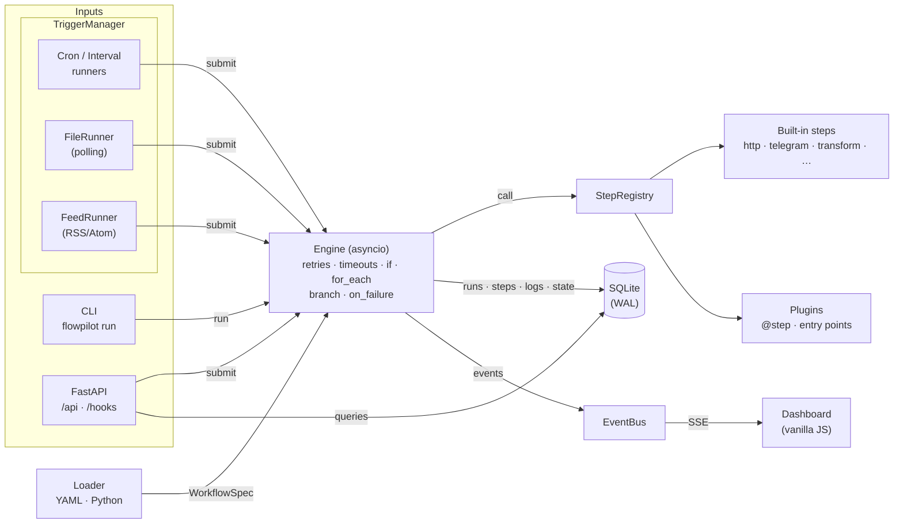

<div align="center">


# flowpilot

**A lightweight, self-hosted, code-first workflow automation engine — with first-class Telegram support.**

Think of a tiny n8n/Zapier that lives in a Git repo, runs on a $5 VPS or a Raspberry Pi,
and is configured with readable YAML (or Python).

[](https://github.com/mrzroot/flowpilot/actions/workflows/ci.yml)
[](https://github.com/mrzroot/flowpilot/releases)
[](https://github.com/mrzroot/flowpilot/blob/main/pyproject.toml)
[](LICENSE)
[](https://github.com/mrzroot/flowpilot/stargazers)
[](https://github.com/astral-sh/ruff)

[Website](https://mrzroot.github.io/flowpilot/) ·
[Quick start](#-quick-start) ·
[YAML reference](#-yaml-reference) ·
[Plugins](#-writing-plugins) ·
[Deployment](#-deployment) ·
[FAQ](#-faq) ·
[فارسی](#-فارسی)


</div>

### ⚡ Quickstart

```bash
pipx install "git+https://github.com/mrzroot/flowpilot.git"
flowpilot init my-automations && cd my-automations
flowpilot run hello      # then: flowpilot serve → dashboard on http://127.0.0.1:8080
```

---

## ✨ Why flowpilot?

- **Code-first.** Workflows are small YAML files you can review, diff and version in Git — no clicking through a canvas, no database-only state.
- **Tiny footprint.** One Python process, SQLite, no Redis/Postgres/Node. Comfortable on a Raspberry Pi or the cheapest VPS.
- **Telegram built in.** Send messages, files and photos, split long messages automatically, call any Bot API method, and point it at a self-hosted Bot API server or proxy when `api.telegram.org` is unreachable.
- **Batteries included.** Cron, webhooks, file watching, RSS feeds, HTTP, transforms, branching, retries with backoff, timeouts, persistent state, backups, SQLite, email.
- **A dashboard you'll actually like.** Live log streaming, run history, one-click runs, enable/disable — served by the same process, no build step, dark and light themes.
- **Extensible in five lines.** Write a Python function, decorate it with `@step`, use it in YAML.

```yaml
# workflows/github-release-watcher.yaml
name: github-release-watcher
trigger:
  type: cron
  cron: "*/30 * * * *"
vars:
  repos: [astral-sh/uv, fastapi/fastapi]
steps:
  - id: releases
    type: http
    for_each: "{{ vars.repos }}"
    retry: { attempts: 3, delay: 2 }
    with:
      url: "https://api.github.com/repos/{{ item }}/releases/latest"

  - id: announce
    type: telegram
    for_each: "{{ steps.releases.results }}"
    if: "{{ item.ok and item.output.json.tag_name != (state.tags or {}).get(item.item) }}"
    with:
      text: "🚀 <b>{{ item.item }}</b> {{ item.output.json.tag_name }}\n{{ item.output.json.html_url }}"

  - id: remember
    type: state
    for_each: "{{ steps.releases.results | selectattr('ok') | list }}"
    with:
      merge: { tags: { "{{ item.item }}": "{{ item.output.json.tag_name }}" } }
```

## 📸 Screenshots

Captured with headless Chromium from a local instance running the [example workflows](examples/) (Telegram calls went to the bundled [mock Bot API](scripts/mock_telegram.py); the GitHub, CoinGecko, exchange-rate and Hacker News data is real).

| Live run detail | Workflow detail |
| --- | --- |
|  |  |
| **Failure + `on_failure` handling** | **Run history (light theme)** |
|  |  |

<details>
<summary>More: workflows grid, step catalogue, light overview, mobile</summary>


</details>

## 🚀 Quick start

flowpilot is not published on PyPI yet — install it from GitHub (or grab the wheel from the [latest release](https://github.com/mrzroot/flowpilot/releases)):

```bash
pipx install "git+https://github.com/mrzroot/flowpilot.git"
# or: pip install "git+https://github.com/mrzroot/flowpilot.git"
```

Create a project and run your first workflow:

```bash
flowpilot init my-automations && cd my-automations
flowpilot validate          # static checks: YAML, step types, parameters
flowpilot run hello         # run once, print the result
flowpilot serve             # dashboard + API + triggers on http://127.0.0.1:8080
```

Connect Telegram: create a bot with [@BotFather](https://t.me/BotFather), then put the token in `.env`:

```dotenv
TELEGRAM_BOT_TOKEN=123456:ABC...
TELEGRAM_CHAT_ID=123456789      # your user id, a group id or @channel_name
```

Try the bundled examples without a real bot:

```bash
git clone https://github.com/mrzroot/flowpilot && cd flowpilot
pip install -e .
python scripts/mock_telegram.py --port 8081 &
TELEGRAM_API_BASE=http://127.0.0.1:8081 TELEGRAM_BOT_TOKEN=test TELEGRAM_CHAT_ID=1 \
  flowpilot -p examples run crypto-digest
```

### CLI

| Command | What it does |
| --- | --- |
| `flowpilot init [DIR]` | Scaffold a project (`flowpilot.yaml`, `.env.example`, example workflows) |
| `flowpilot validate` | Validate every workflow file; non-zero exit on errors (great for CI) |
| `flowpilot list` | Workflows with trigger, enabled state and last status |
| `flowpilot run NAME [--payload JSON] [--json]` | Run a workflow once in the foreground |
| `flowpilot serve [--host --port --no-triggers]` | Web server, dashboard, REST API and all triggers |
| `flowpilot logs [RUN_ID] [-w NAME] [-f]` | Recent runs, or steps + logs of one run (id prefixes work) |
| `flowpilot steps` | Built-in and plugin step types |

Global option: `-p/--project DIR` (or `FLOWPILOT_PROJECT`).

## 🧩 Examples

All in [`examples/workflows`](examples/workflows) — run `flowpilot -p examples serve` to explore them in the dashboard.

| Workflow | Trigger | What it does |
| --- | --- | --- |
| [`github-release-watcher`](examples/workflows/github-release-watcher.yaml) | cron | Announces each new GitHub release exactly once (persistent state) |
| [`uptime-monitor`](examples/workflows/uptime-monitor.yaml) | interval | Alerts only when a site goes **down** or **recovers** |
| [`crypto-digest`](examples/workflows/crypto-digest.yaml) | cron 09:00 Asia/Tehran | Crypto prices (CoinGecko) + USD exchange rates, with the Jalali date |
| [`rss-to-telegram`](examples/workflows/rss-to-telegram.yaml) | feed | One channel post per new feed entry, cleaned by a custom plugin step |
| [`nightly-backup`](examples/workflows/nightly-backup.yaml) | cron | `tar.gz` backup with 7-day retention, uploaded to Telegram, alert on failure |
| [`contact-form`](examples/workflows/contact-form.yaml) | webhook + secret | Website contact form → Telegram |
| [`discord-notification`](examples/workflows/discord-notification.yaml) | manual | Sends a message and embed through an incoming Discord webhook |
| [`disk_space.py`](examples/workflows/disk_space.py) | cron | A workflow **written in Python** with its own custom step |

## 🏗 Architecture



- **Loader** parses YAML/Python into Pydantic models and statically checks every step type and parameter.
- **Engine** executes steps sequentially inside an asyncio task per run, rendering parameters with sandboxed Jinja2 right before each attempt. Sync step handlers run in worker threads, so a slow handler never blocks the event loop.
- **Store** persists runs, step results (outputs truncated to a configurable size), logs and per-workflow state in SQLite; interrupted runs are marked failed on restart and old history is pruned automatically.
- **EventBus** fans out run/step/log events to Server-Sent Events subscribers — that is what makes the dashboard live.

## 📘 YAML reference

### Workflow

```yaml
name: my-workflow            # letters, digits, . _ - (defaults to the file name)
description: What it does
enabled: true                # can be overridden from the dashboard/API
tags: [monitoring]
trigger: { type: manual }    # see "Triggers"; the string `manual` also works
vars: { threshold: 90 }      # rendered once per run; may use env/trigger
timeout: 600                 # whole-run timeout (seconds)
concurrency: 1               # max simultaneous runs of this workflow
steps: [...]                 # executed in order
on_failure: [...]            # run when the workflow fails; `run.error` holds the reason
```

### Triggers

| Type | Keys | Payload available as `trigger` |
| --- | --- | --- |
| `manual` | — | JSON passed via CLI `--payload`, API or dashboard |
| `cron` | `cron` (5 or 6 fields), `timezone` (e.g. `Asia/Tehran`) | `scheduled_at` |
| `interval` | `seconds`, `run_on_start` | `scheduled_at` |
| `webhook` | `path` (default: workflow name), `methods` (default `[POST]`), `secret`, `wait` | `method`, `path`, `query`, `headers`, `body` (JSON, form or text), `client` |
| `file` | `path`, `patterns` (globs), `events` (`created`/`modified`/`deleted`), `interval`, `recursive` | `event`, `path`, `name`, `suffix` |
| `feed` | `url`, `interval` (s), `initial` (`skip`/`fire`), `max_items` | `entry` (`title`, `link`, `summary`, `author`, `published`, `tags`, `id`), `feed` |

Webhooks are served at `/hooks/<path>`. With a `secret`, requests must send it as `X-Flowpilot-Secret` header or `?secret=` — or be signed GitHub-style with `X-Hub-Signature-256`. With `wait: true` the HTTP response contains the run result and the last step's output (handy for building small APIs).

### Steps

Every step accepts these keys:

| Key | Meaning |
| --- | --- |
| `id` | Identifier used in templates (`steps.<id>.output`); auto-generated if omitted |
| `type` | Step type (see below or `flowpilot steps`) |
| `with` | Parameters — strings are templates |
| `if` | Condition: bool, bare expression (`trigger.n > 3`) or `{{ template }}` |
| `for_each` | List (or template producing one) — the step runs once per `item`; with a loop, `if` filters items |
| `timeout` | Seconds per attempt |
| `retry` | `{attempts, delay, backoff, max_delay}` or just a number of attempts |
| `continue_on_error` | Record the failure but keep going |

A step's record is available to later steps as `steps.<id>.status`, `.output`, `.error`; looped steps also expose `.results` — a list of `{item, ok, output, error}`.

| Type | Parameters (`*` = required) |
| --- | --- |
| `http` | `url*`, `method`, `headers`, `params`, `json`, `data`, `timeout`, `expect_status`, `fail_on_error` (default true), `follow_redirects`, `auth` → output `status`, `ok`, `json`, `text`, `headers`, `elapsed_ms` |
| `telegram` | `text`, `chat_id`, `parse_mode` (`HTML`), `document`, `photo`, `caption`, `disable_preview`, `silent`, `thread_id`, `token`, `method` + `payload` (any Bot API call) |
| `discord` | `content` (up to 2000 characters), `embeds` (up to 10 objects), `webhook_url` (defaults to `DISCORD_WEBHOOK_URL`), `username`, `avatar_url`, `allowed_mentions` (defaults to `{parse: []}`), `thread_id`, `timeout` → output `message_id`, `channel_id` |
| `email` | `to*`, `subject*`, `body`, `html`, `sender`, `host`, `port`, `username`, `password`, `security` (`starttls`/`ssl`/`none`) — defaults from `SMTP_*` env vars |
| `transform` | `value`, `template`, `data` + `jmespath`, `parse_json` |
| `condition` | `check*`, `reason` — stops the run (successfully) when false |
| `branch` | `cases: [{when, steps}]`, `default: [steps]` |
| `delay` | `seconds*` |
| `log` | `message*`, `level` |
| `python` | `function*` (`module:func`), `args` — gets `ctx` if it asks for it |
| `shell` | `command*` (string or list), `cwd`, `env`, `check`, `timeout` — **disabled unless `allow_shell: true`** |
| `file.write` / `file.read` | `path*`, `content*`, `mode` (`overwrite`/`append`), `newline` / `path*`, `parse` (`json`/`lines`) |
| `sqlite` | `database*`, `query*`, `params`, `many`, `script` → `rows`, `rowcount`, `lastrowid` |
| `state` | `set`, `merge` (deep), `delete` — persisted per workflow, readable as `state.<key>` |
| `archive` | `source*`, `destination*`, `format` (`tar.gz`/`zip`), `prefix`, `exclude`, `keep` |

The `discord` step requires `content` or `embeds`. Create an incoming webhook in
your Discord channel's integrations settings and keep its URL in `.env` as
`DISCORD_WEBHOOK_URL`. It sends with `wait=true` to confirm delivery. Network errors,
HTTP 429 and 5xx responses can be retried with the step's `retry` setting; other HTTP
errors fail immediately. Mentions are disabled by default; pass `allowed_mentions`
to opt in. Use the [notification example](examples/workflows/discord-notification.yaml)
to try it.

### Templates

Templates are [Jinja2](https://jinja.palletsprojects.com/) in a sandbox. A value that is exactly one `{{ expression }}` keeps its native type (lists stay lists); anything else renders to a string. Missing values are forgiving (`steps.x.output.missing` is just empty).

| Variable | Contents |
| --- | --- |
| `trigger` | Trigger payload |
| `vars` | Rendered workflow `vars` |
| `steps` | Previous step records |
| `state` | Persistent workflow state |
| `env` | Environment variables (incl. `.env`) |
| `run` | `id`, `trigger`, `started_at`, `error` (in `on_failure`) |
| `workflow` | `name`, `description`, `tags` |
| `item`, `loop` | Inside `for_each`: current item and `index`, `index0`, `first`, `last`, `length` |

Extra filters: `jmespath('a[].b')`, `number(2)` (thousands separators), `tojson`, `fromjson`, `md_escape` (Telegram MarkdownV2), `strftime`, `truncate_text`, `b64encode`, `b64decode`, `sha256`, `jalali('%d %B %Y')` (Persian calendar), `fa_digits`. Globals: `now(tz)`, `uuid()`.

### Settings (`flowpilot.yaml`)

| Key | Env var | Default |
| --- | --- | --- |
| `workflows_dir` | `FLOWPILOT_WORKFLOWS_DIR` | `workflows` |
| `database` | `FLOWPILOT_DATABASE` | `.flowpilot/flowpilot.db` |
| `host` / `port` | `FLOWPILOT_HOST` / `FLOWPILOT_PORT` | `127.0.0.1` / `8080` |
| `allow_shell` | `FLOWPILOT_ALLOW_SHELL` | `false` |
| `api_token` | `FLOWPILOT_API_TOKEN` | unset (no auth) |
| `plugins` | `FLOWPILOT_PLUGINS` (comma-separated) | `[]` |
| `history_days` | `FLOWPILOT_HISTORY_DAYS` | `30` (`0` keeps everything) |
| `log_level` / `log_format` | `FLOWPILOT_LOG_LEVEL` / `FLOWPILOT_LOG_FORMAT` | `INFO` / `text` (or `json`) |
| `telegram_api_base` | `TELEGRAM_API_BASE` | `https://api.telegram.org` |

### Python workflows

Any `.py` file in the workflows directory is imported; every `WorkflowSpec` it defines is loaded:

```python
from flowpilot import define

workflow = define(
    "hello-python",
    trigger={"type": "cron", "cron": "0 8 * * *", "timezone": "Asia/Tehran"},
    steps=[{"id": "hi", "type": "log", "with": {"message": "صبح بخیر!"}}],
)
```

## 🔌 Writing plugins

A step type is a function whose first argument is the step context and whose keyword arguments come from `with:`. Sync functions run in a thread; async functions are awaited.

```python
# plugins/weather.py
from flowpilot import StepContext, StepError, step


@step("weather", description="Current temperature for a city")
async def weather(ctx: StepContext, city: str, units: str = "metric") -> dict:
    resp = await ctx.http.get("https://wttr.in/" + city, params={"format": "j1"})
    if resp.status_code != 200:
        raise StepError(f"wttr.in returned {resp.status_code}")  # retryable
    ctx.log.info(f"fetched weather for {city}")
    return {"temp_c": resp.json()["current_condition"][0]["temp_C"]}
```

Enable it in `flowpilot.yaml` (`plugins: [plugins.weather]`) and use it:

```yaml
- id: now
  type: weather
  with: { city: Mashhad }
```

`flowpilot validate` checks plugin parameters too (unknown / missing keys). To ship steps as a package, expose a module or a `register(registry)` callable in the `flowpilot.steps` entry-point group:

```toml
[project.entry-points."flowpilot.steps"]
weather = "flowpilot_weather"
```

The `StepContext` gives you `ctx.log`, a shared `ctx.http` (`httpx.AsyncClient`), `ctx.settings`, `ctx.resolve_path()`, `ctx.render()`, `ctx.update_state()` and the current `ctx.attempt`. Raise `StepConfigError` for invalid input (never retried) and `StepError(..., retryable=False)` for permanent failures.

## 📦 Deployment

### Docker Compose

```bash
git clone https://github.com/mrzroot/flowpilot && cd flowpilot
mkdir project                     # your workflows live here (scaffolded on first start)
docker compose up -d
```

The container runs as an unprivileged user, scaffolds `./project` on first boot, exposes a health check on `/api/health` and binds to `127.0.0.1:8080` by default. Put secrets in `./project/.env`.

### systemd (VPS / Raspberry Pi)

```ini
# /etc/systemd/system/flowpilot.service
[Unit]
Description=flowpilot workflow automation
After=network-online.target
Wants=network-online.target

[Service]
User=flowpilot
WorkingDirectory=/home/flowpilot/automations
ExecStart=/home/flowpilot/.local/bin/flowpilot serve
Restart=on-failure
Environment=FLOWPILOT_LOG_FORMAT=json

[Install]
WantedBy=multi-user.target
```

```bash
sudo systemctl enable --now flowpilot
journalctl -u flowpilot -f
```

### Behind a reverse proxy

Set `FLOWPILOT_API_TOKEN` and keep flowpilot on localhost. Example with Caddy (automatic HTTPS):

```caddyfile
automations.example.com {
    reverse_proxy 127.0.0.1:8080
}
```

Server-Sent Events work through Caddy and nginx (flowpilot sends `X-Accel-Buffering: no`). The dashboard prompts for the token and stores it in the browser's local storage. See [SECURITY.md](SECURITY.md) for a hardening checklist.

## ❓ FAQ

**How is this different from n8n, Huginn or Node-RED?**
Those are powerful, UI-first platforms. flowpilot is deliberately small and code-first: workflows are text files in Git, the runtime is a single Python process with SQLite, and extending it means writing a normal Python function. If you need hundreds of SaaS integrations and a visual editor, use n8n; if you want readable automations you can review in a pull request and run on a Pi, try flowpilot.

**`api.telegram.org` is blocked where my server is. What can I do?**
Set `TELEGRAM_API_BASE` to a [self-hosted Bot API server](https://github.com/tdlib/telegram-bot-api) or a reverse proxy you control, or route outgoing traffic through a proxy with `HTTPS_PROXY` / `ALL_PROXY` (install `flowpilot[socks]` for `socks5://` proxies — the Docker image includes it).

**Can I run workflows only from the CLI, without the server?**
Yes. `flowpilot run NAME` executes once and exits with a non-zero status on failure, so it composes with system cron, CI jobs or shell scripts. Runs still go into the same history.

**Are missed cron runs replayed after downtime?**
No — schedules continue from the next occurrence. Runs that were in progress when the process died are marked as failed (`interrupted`) on the next start.

**How do I avoid duplicate notifications?**
Use the `state` step to remember what you've already sent (see the release watcher and uptime monitor examples). Feed triggers deduplicate entries automatically.

**Is it production-ready?**
It's a young (0.x) project with a thorough test suite. It runs as a single process (no clustering). Pin a version and read the changelog when upgrading.

**Does flowpilot collect telemetry?**
No. It only makes the HTTP requests your workflows define.

## 🛠 Development

```bash
pip install -e ".[dev]"
pytest --cov=flowpilot      # 150 tests
ruff check . && ruff format --check . && mypy
```

See [CONTRIBUTING.md](CONTRIBUTING.md). Contributions — especially new step types and triggers — are welcome.

---

<div dir="rtl">

## 🇮🇷 فارسی

**flowpilot** یک موتور اتوماسیون گردش‌کار سبک، خودمیزبان و کدمحور با پایتون است؛ چیزی شبیه یک n8n یا Zapier کوچک که روی یک VPS ارزان یا رزبری‌پای اجرا می‌شود و از همان ابتدا با **تلگرام** به‌عنوان پیام‌رسان اصلی طراحی شده است.

### چرا flowpilot؟

- **کدمحور:** هر گردش‌کار یک فایل YAML خوانا (یا پایتون) است که در گیت نگه‌داری و بازبینی می‌شود.
- **سبک:** فقط یک پروسهٔ پایتون و SQLite؛ بدون نیاز به Redis، Postgres یا Node.
- **تلگرام داخلی:** ارسال پیام، فایل و عکس، تقسیم خودکار پیام‌های طولانی، فراخوانی هر متد Bot API و امکان استفاده از سرور Bot API شخصی یا پراکسی (`TELEGRAM_API_BASE` و `HTTPS_PROXY`) وقتی دسترسی مستقیم به تلگرام ممکن نیست.
- **تقویم جلالی:** فیلتر `jalali` تاریخ شمسی را در پیام‌ها نمایش می‌دهد؛ مثلاً `{{ now('Asia/Tehran') | jalali('%d %B %Y') }}` و `fa_digits` برای ارقام فارسی.
- **امکانات کامل:** زمان‌بندی cron با منطقهٔ زمانی تهران، وب‌هوک، پایش فایل، خوراک RSS، درخواست HTTP، شرط و انشعاب، تلاش مجدد با backoff، timeout، حالت ماندگار، پشتیبان‌گیری و ارسال ایمیل.
- **داشبورد زیبا:** نمایش زندهٔ لاگ اجرا، تاریخچه، اجرای دستی و فعال/غیرفعال‌سازی با تم روشن و تیره.
- **قابل توسعه:** با دکوریتور `@step` یک تابع پایتون را به یک گام جدید تبدیل کنید.

### شروع سریع

<div dir="ltr">

```bash
pipx install "git+https://github.com/mrzroot/flowpilot.git"
flowpilot init my-automations && cd my-automations
flowpilot run hello
flowpilot serve   # http://127.0.0.1:8080
```

</div>

توکن ربات را از [@BotFather](https://t.me/BotFather) بگیرید و در فایل `.env` قرار دهید (`TELEGRAM_BOT_TOKEN` و `TELEGRAM_CHAT_ID`). نمونه‌های آماده در پوشهٔ `examples` شامل این موارد هستند: اطلاع‌رسانی نسخه‌های جدید گیت‌هاب، پایش در دسترس بودن وب‌سایت، گزارش روزانهٔ قیمت رمزارز و نرخ ارز (ساعت ۹ صبح به وقت تهران)، انتشار خودکار RSS در کانال تلگرام، پشتیبان‌گیری شبانه و فرم تماس وب‌سایت.

### نمونهٔ ساده

<div dir="ltr">

```yaml
name: good-morning
trigger: { type: cron, cron: "0 8 * * *", timezone: Asia/Tehran }
steps:
  - id: send
    type: telegram
    with:
      text: "☀️ صبح بخیر! امروز {{ now('Asia/Tehran') | jalali('%A %d %B %Y') | fa_digits }}"
```

</div>

### امنیت

داشبورد و API به‌صورت پیش‌فرض فقط روی `127.0.0.1` در دسترس هستند. اگر سرور را روی شبکه باز می‌کنید حتماً `FLOWPILOT_API_TOKEN` را تنظیم کنید، برای وب‌هوک‌ها `secret` بگذارید و گام `shell` را فقط در صورت نیاز فعال کنید. جزئیات بیشتر در [SECURITY.md](SECURITY.md).

مشارکت، گزارش باگ و پیشنهاد گام‌های جدید با کمال میل پذیرفته می‌شود.

</div>

---

<div align="center">

MIT © 2026 <a href="https://github.com/mrzroot">Mohammadreza Zare</a> · Built in Mashhad 🇮🇷

</div>
